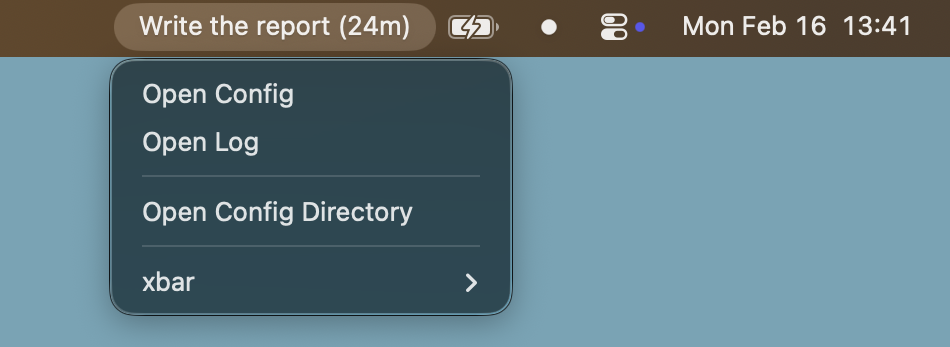
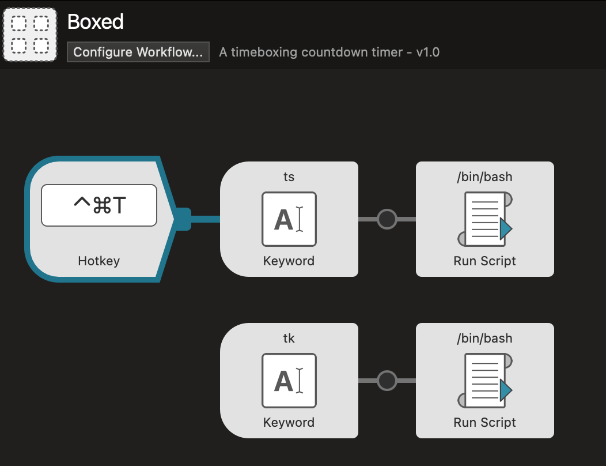

# Boxed

A timeboxing countdown timer that lives in your macOS menu bar. Built as an [xbar](https://xbarapp.com/) plugin with no external dependencies (stdlib-only Go).

I vibe-coded this for my own use because I found myself constantly getting distracted by other incoming tasks.



## How It Works

When a timer is running, the menu bar shows the task name and remaining time (e.g. `Write the report (24m)`). When no timer is active or after a timer expires, it shows 📦.

Clicking the menu bar icon reveals options to open your config file, activity log, or config directory.

When a timer starts, expires, or is stopped, you get a macOS notification with an optional sound.

## Usage

```bash
# Start a 25-minute timer
boxed start 25 Write the report

# Stop the current timer early
boxed stop

# Repeat the last timer (same duration and task)
boxed again

# Mark an expired timer as complete (used internally by the xbar plugin)
boxed complete
```

Starting a new timer while one is already running will automatically stop the previous timer and start the new one.

## Install

Requires [xbar](https://xbarapp.com/) and Go.

```bash
make install
```

This builds two binaries:
- `~/bin/boxed` — the CLI you interact with
- `~/Library/Application Support/xbar/plugins/boxed.1s.cgo` — the xbar plugin that renders the menu bar (refreshes every 1 second)

To uninstall:

```bash
make uninstall
```

## Tips

Since `boxed` is a plain CLI, you can wire it into any launcher. For example, with an [Alfred](https://www.alfredapp.com/) workflow you can set up keywords like `ts 25 Write the report` to start a timer and `tk` to stop it, optionally bound to a hotkey for even faster access.



## Configuration

Config lives at `~/.config/boxed/config` (created automatically on first run):

```
# Play sounds on timer start/stop/complete (default: true)
notify_sound = true

# Play a tick sound at regular intervals while the timer is running (default: disabled)
tick_interval = 5m
```

## Activity Log

Boxed keeps a human-readable log at `~/.config/boxed/log`, grouped by date with newest dates first. Each entry shows the time range, task name, elapsed duration, and outcome:

```
# 2026-02-16

09:00:00 - 09:25:00 Write the report (25m0s) ✓
09:30:00 - 09:42:15 Review PRs (12m15s) ✕
10:00:00 - 10:50:00 Design new API (50m0s) ✓
11:00:00 - 11:25:00 Fix login bug (25m0s) ✓
14:00:00 - 14:10:30 Reply to emails (10m30s) ✕
15:00:00 - 15:25:00 Write unit tests (25m0s) ✓

# 2026-02-15

09:15:00 - 09:40:00 Sprint planning (25m0s) ✓
10:00:00 - 10:50:00 Implement auth flow (50m0s) ✓
13:00:00 - 13:18:45 Code review (18m45s) ✕
14:00:00 - 14:25:00 Update documentation (25m0s) ✓
```

- ✓ = timer completed (ran to expiry)
- ✕ = timer stopped early

## Development

```bash
make build      # build binaries to build/
make test       # run tests
make lint       # run go vet
make fmt        # format code
```
